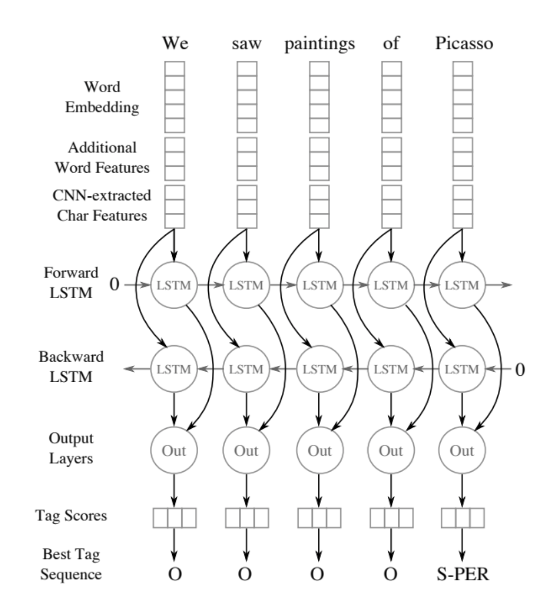

## Goal

[Implenting NN architecture from this paper](https://www.aclweb.org/anthology/Q16-1026) for the task of named entity recognition in MXNet.

## Datasets

#### For POC

- [Download the dataset](https://www.kaggle.com/abhinavwalia95/entity-annotated-corpus)

#### For performance comparison

- [Download the dataset](https://www.clips.uantwerpen.be/conll2003/ner.tgz)
- [Request access to Reuters Corpora](http://trec.nist.gov/data/reuters/reuters.html)
- Follow the instructions in the [README](https://www.clips.uantwerpen.be/conll2003/ner/000README) to generate training files

## Notes

- Label shape is wrong.  Should be one hot encoded? Check what you did for CNN language model

## Improvements

- Vary LSTM unrolling by input size using [MXNet bucketizers](https://mxnet.incubator.apache.org/how_to/bucketing.html), instead of padding utterances
- Add CNN feature generation
- 

